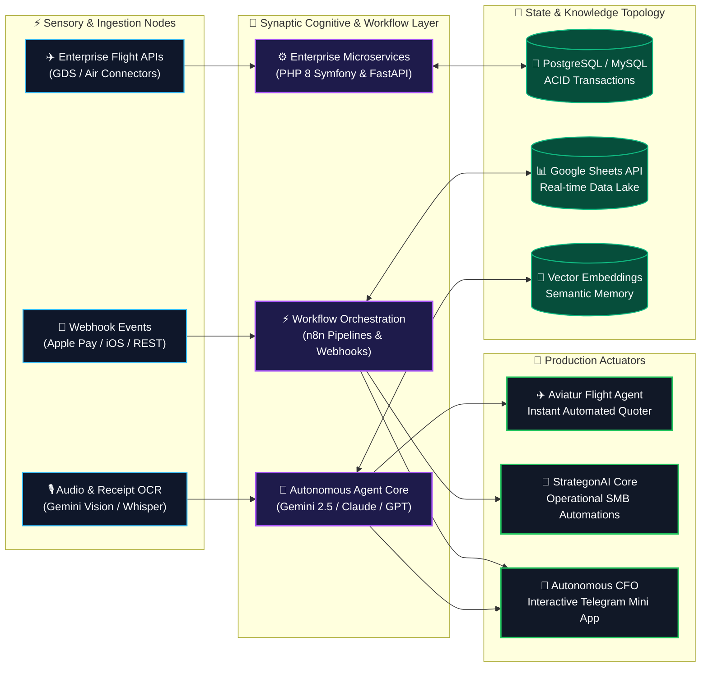

<div align="center">
  <!-- Dynamic Neural Waveform Header -->
  

  <p align="center">
    <a href="https://www.linkedin.com/in/dilan-garrido-bab3a413a/"></a>
    <a href="https://strategonai.com"></a>
    
    
  </p>
</div>

---

### 🧠 Synaptic Transmission // About Me

> **I architect intelligent neural pipelines, agentic workflows, and high-concurrency backend backbones.**  
> Currently shipping enterprise flight-quoting AI agents at **[Aviatur](https://www.aviatur.com)**, co-founding **[StrategonAI](https://strategonai.com)** to automate mission-critical operations for LatAm businesses, and building serverless multimodal financial intelligence agents.

```
       ___ __             dilan@neural-arch
  ____/ (_) /___ _____    -----------------
 / __  / / / __ `/ __ \   OS: Arch Linux x86_64
/ /_/ / / / /_/ / / / /   Neural Core: PHP (Symfony) • Python (FastAPI)
\__,_/_/_/\__,_/_/ /_/    Synaptic AI: n8n • Gemini 2.5 • Claude • Agent Swarms
                          Active Nodes: Aviatur • StrategonAI • Autonomous CFO
```

---

### 🌐 Neural Architecture // Processing Topology

A real-time overview of how sensory inputs, cognitive LLM reasoning, and enterprise execution nodes interconnect across my production systems:

<div align="center">
  
</div>



---

### 🚀 Active Synapses // Flagship Deployments

<table>
  <tr>
    <td width="33%" valign="top">
      <h4>✈️ Node 01 // Aviatur Flight Agent</h4>
      <p><b>Role:</b> Backend Dev @ Aviatur S.A.S.</p>
      <p>Engineering autonomous flight-quoting engines integrated with enterprise GDS APIs. Translates complex route requests into multi-carrier quotes in real time, drastically reducing operational response times.</p>
      <p><code>PHP</code> <code>Symfony</code> <code>Python</code> <code>REST GDS</code></p>
    </td>
    <td width="33%" valign="top">
      <h4>🚀 Node 02 // StrategonAI LatAm</h4>
      <p><b>Role:</b> Co-founder &amp; AI Architect</p>
      <p>Designing end-to-end AI automation infrastructure for high-growth SMBs in Latin America. Building autonomous lead-qualification swarms, CRM synchronizers, and operational pipelines.</p>
      <p><code>n8n</code> <code>Python</code> <code>Claude</code> <code>OpenAI</code></p>
    </td>
    <td width="33%" valign="top">
      <h4>💎 Node 03 // Autonomous CFO</h4>
      <p><b>Role:</b> Creator &amp; Architect</p>
      <p>Serverless personal wealth guardian running 24/7 on Apps Script &amp; Telegram. Features Gemini 2.5 multimodal receipt/audio parsing, in-place message navigation, and a dark-mode Telegram Mini App.</p>
      <p><a href="https://github.com/NotProgram/personal-finance-cfo"><b>Explore Repo →</b></a></p>
      <p><code>Apps Script</code> <code>Gemini 2.5</code> <code>Chart.js</code></p>
    </td>
  </tr>
</table>

---

### ⚡ Synaptic Weight Matrix // Core Stack

<div align="center">

| Neural Domain | Technologies & Frameworks |
| :--- | :--- |
| **🧠 Cognitive & Agentic AI** | `Python` `FastAPI` `Gemini 2.5 Multimodal` `Claude 3.7` `OpenAI API` `n8n` `LangChain` `Prompt Architecture` |
| **⚡ Enterprise Backend** | `PHP 8+` `Symfony` `Node.js` `RESTful APIs` `Microservices` `Clean Architecture` `MVC` |
| **💾 Knowledge & State** | `PostgreSQL` `MySQL` `Redis` `Google Sheets API` `Vector Embeddings` `JSON Schemas` |
| **🛠️ Runtime & DevOps** | `Arch Linux` `Docker` `Git` `GitHub Actions` `Bash Scripting` `Google Apps Script` `Telegram WebApps` |

</div>

<p align="center">
  
  
  
  
  
  
  
  
  
</p>

---

### 📊 Synaptic Telemetry // GitHub Metrics

<div align="center">
  
  
</div>

---

### 💻 Systemd Matrix Output

```text
[dilan@neural-arch ~]$ systemctl status cognitive-engine.service
● cognitive-engine.service - Autonomous AI & Enterprise Backend Daemon
     Loaded: loaded (/etc/systemd/system/cognitive-engine.service; enabled)
     Active: active (running) since boot; continuous synaptic streaming
   Main PID: 2026 (dilan_garrido)
      Tasks: 16 active threads (Enterprise Quoters, SMB Agents, Multimodal CFO)
     Memory: High-bandwidth neural throughput
     Status: "Operational. Shipping real-world business AI automations across LatAm."

[dilan@neural-arch ~]$ ping -c 2 freelance_and_collab_opportunities
PING freelance_and_collab_opportunities (127.0.0.1) 56(84) bytes of data.
64 bytes from open_to_collaborate: icmp_seq=1 ttl=64 time=0.038 ms
64 bytes from lets_build_together: icmp_seq=2 ttl=64 time=0.034 ms
--- 0% packet loss, always ready to build ---
```

---

### 📡 Transmission Channels // Connect

<div align="center">
  <a href="https://www.linkedin.com/in/dilan-garrido-bab3a413a/">
    
  </a>
  &nbsp;
  <a href="https://strategonai.com">
    
  </a>
  &nbsp;
  <a href="https://github.com/NotProgram?tab=repositories">
    
  </a>
</div>

<br/>

<div align="center">
  <sub>⚡ Powered by Arch Linux, Caffeine, and Autonomous Neural Synapses. Designed by <b>Dilan Garrido</b>.</sub>
</div>
