<div align="center">

  <p align="center" style="font-size: 11px; letter-spacing: 3px; text-transform: uppercase; color: #86868b; font-weight: 600; margin-bottom: 6px;">
    NEURAL ARCHITECTURES &bull; ENTERPRISE BACKEND &bull; AGENTIC AUTOMATION
  </p>

  <h1 align="center" style="font-size: 42px; font-weight: 700; letter-spacing: -1.2px; color: #ffffff; margin: 0;">
    Dilan Garrido
  </h1>

  <p align="center" style="font-size: 16px; color: #a1a1a6; max-width: 580px; line-height: 1.5; margin-top: 8px;">
    Backend Engineer &amp; AI Automation Architect.<br/>
    Building high-concurrency systems at <b>Aviatur</b> and scaling autonomous agent workflows with <b>StrategonAI</b>.
  </p>

  <p align="center">
    <a href="https://www.linkedin.com/in/dilan-garrido-bab3a413a/"></a>
    &nbsp;
    <a href="https://strategonai.com"></a>
    &nbsp;
    <a href="https://github.com/NotProgram?tab=repositories"></a>
  </p>

</div>

<br/>

<div align="center">
  
</div>

<br/>

---

### Focus & Deployments

<table>
  <tr>
    <td width="33%" valign="top">
      <p style="font-size: 10px; letter-spacing: 1.5px; color: #86868b; text-transform: uppercase; font-weight: 600; margin-bottom: 4px;">01 // ENTERPRISE</p>
      <h3>Aviatur Flight Agent</h3>
      <p style="color: #a1a1a6; font-size: 13px; line-height: 1.6;">
        Autonomous flight-quoting engine integrated with airline GDS APIs. Translates complex route requests into multi-carrier quotes in real time, cutting turnaround times from hours to seconds.
      </p>
      <p style="font-size: 11px; color: #ffffff;"><code>PHP (Symfony)</code> &bull; <code>Amazon Aurora</code> &bull; <code>Flight GDS APIs</code></p>
    </td>
    <td width="33%" valign="top">
      <p style="font-size: 10px; letter-spacing: 1.5px; color: #86868b; text-transform: uppercase; font-weight: 600; margin-bottom: 4px;">02 // STARTUP</p>
      <h3>StrategonAI Core</h3>
      <p style="color: #a1a1a6; font-size: 13px; line-height: 1.6;">
        Co-founder &amp; AI Architect. Designing end-to-end intelligent automation pipelines and autonomous agent swarms for high-growth businesses across Latin America.
      </p>
      <p style="font-size: 11px; color: #ffffff;"><code>n8n</code> &bull; <code>LLM Orchestration</code> &bull; <code>Agent Swarms</code></p>
    </td>
    <td width="33%" valign="top">
      <p style="font-size: 10px; letter-spacing: 1.5px; color: #86868b; text-transform: uppercase; font-weight: 600; margin-bottom: 4px;">03 // AUTONOMOUS</p>
      <h3>Autonomous Personal CFO</h3>
      <p style="color: #a1a1a6; font-size: 13px; line-height: 1.6;">
        Serverless personal wealth guardian with multimodal audio &amp; receipt OCR, dynamic in-place navigation, and an interactive dark-mode Telegram Mini App.
      </p>
      <p style="font-size: 11px;"><a href="https://github.com/NotProgram/personal-finance-cfo"><code>Explore Repository &rarr;</code></a></p>
    </td>
  </tr>
</table>

---

### Core Stack & Architecture

```text
Backend Core    ───────  PHP 8+ (Symfony)  •  RESTful Microservices  •  Enterprise Flight GDS
AI & Agents     ───────  Autonomous Agent Swarms  •  n8n Workflows  •  Multi-Agent Orchestration
State & Data    ───────  Amazon Aurora (PostgreSQL / MySQL)  •  Redis  •  ACID Transactions
Environment     ───────  Arch Linux        •  Docker  •  Git  •  AWS Cloud
```

---

### Telemetry

<div align="center">
  
</div>

---

<div align="center">
  <p style="font-size: 13px; color: #86868b;">
    Open to high-impact engineering challenges and strategic AI collaborations.<br/>
    <a href="https://www.linkedin.com/in/dilan-garrido-bab3a413a/" style="color: #ffffff; text-decoration: underline;">Connect on LinkedIn &rarr;</a>
  </p>
</div>
